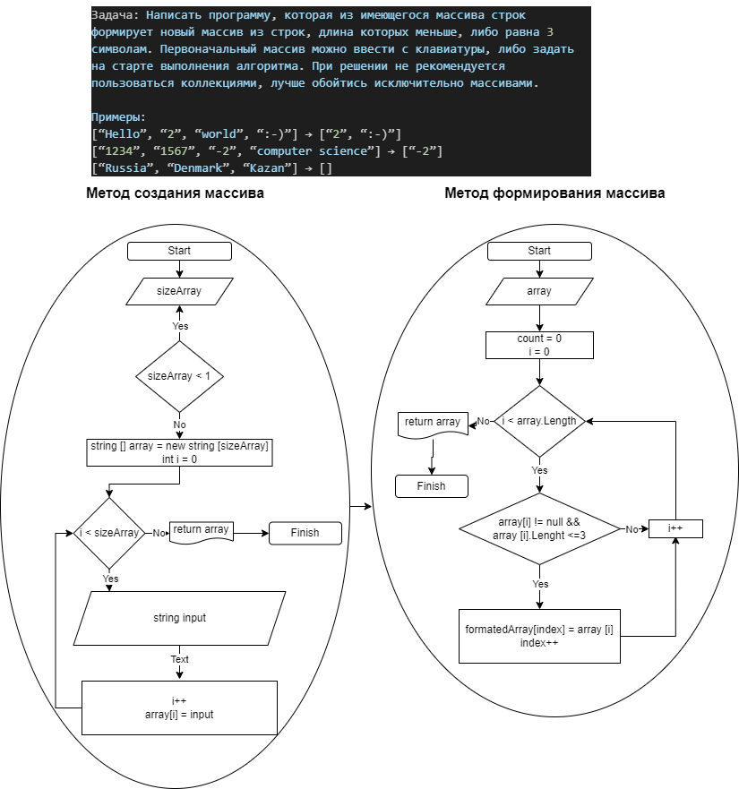

# Описание программы.
## 1. `CreateArray()`: Этот метод предназначен для создания массива строк. Первым действием, в рамках цикла `while`, запрашивается у пользователя длина массива. Цикл будет продолжаться, пока пользователь не введет длину больше 0. Затем создается новый массив строк array указанной пользователем длины. В рамках цикла `for` пользователю предлагается ввести значение для каждого элемента массива. Если пользователь вводит пустую строку, ввод значений прекращается. В результате метод возвращает массив `array` с введенными значениями.

## 2. `FormatArray(string[] array)`: Этот метод предназначен для форматирования исходного массива строк в новый массив, содержащий только те строки, у которых длина не превышает 3 символа. Метод принимает входной массив строк array в качестве аргумента. Внутри метода инициализируется переменная count, которая будет использоваться для подсчета количества подходящих строк. Затем выполняется цикл `for`, в котором проверяется каждый элемент массива array. Если строка не равна null и ее длина не превышает 3 символа, увеличивается значение count. После этого создается новый массив `formattedArray` длиной, соответствующей значению count. Заполняется новый массив, проходя по исходному массиву array и копируя только те строки, которые удовлетворяют условию. Наконец, метод возвращает полученный отформатированный массив `formattedArray`.

## 3. `PrintArray(string[] array)`: Этот метод предназначен для вывода содержимого массива на консоль. Он принимает аргумент, массив строк array. Внутри метода выполняется цикл for, который перебирает элементы массива array. Для каждого элемента выполняется вывод на консоль с помощью `System.Console.Write()`. В результате на консоль выводятся все элементы массива array.

## 4. В основной функции `Main()`: 
   - Создается массив `createArray`, вызывая метод `CreateArray()`. Вводится длина массива, а затем пользователь вводит значения для каждого элемента массива.
   - Создается массив `formatArray`, вызывая метод `FormatArray(createArray)`. В этом методе исходный массив `createArray` передается в качестве аргумента, и возвращается новый массив, содержащий только строки из `createArray`, у которых длина не превышает 3 символа.
   - На консоль выводится текст "Ваш массив: " путем вызова метода `PrintArray(createArray)` для вывода содержимого массива `createArray`.
   - На консоль выводится текст "Массив в котором длина элементов не превышает трех значений: " путем вызова метода `PrintArray(formatArray)` для вывода содержимого массива `formatArray`.

В результате выполнения все строки, введенные пользователем, сохранятся в массиве `createArray`. Затем создается новый массив `formatArray`, содержащий только строки длиной не более 3 символов. Наконец, на консоль выводятся исходный массив createArray и массив `formatArray`.

# Блок-схема программы
